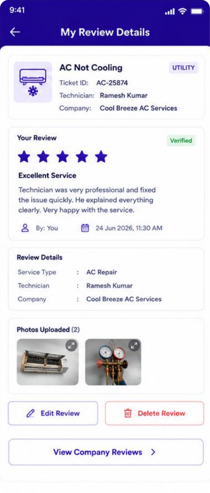

# My Review Details

My review details with the verified review, photos and edit/delete.

Part of the **Cool Breeze AC Services / ChatBucket** screen collection — built with **Expo** (React Native + Expo Router) in TypeScript. Self-contained and runnable on its own.

## Preview



## Run

```bash
npm install
npx expo start -c
```

Then scan the QR code with **Expo Go**, or press `a` for an Android emulator / `w` for web.
> If you see `expo: Permission denied`, run `nvm use 20` first (Node 20+ is required).

## About

- **Theme:** royal purple `#6A4DBB`, rounded cards, soft shadows.
- **Self-contained:** all UI, mock data and styles live in [`app/index.tsx`](./app/index.tsx) — no external `@/src` dependency.
- **Design reference:** the matching design lives in [`chat_for_agent_screens`](../../chat_for_agent_screens).
